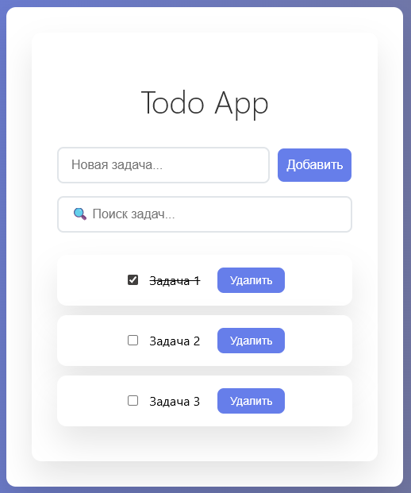

# Todo App

Это простое приложение для управления задачами, созданное с использованием **React**. Оно позволяет добавлять, удалять и отмечать задачи как выполненные. Также есть возможность поиска задач по тексту.

## Основные возможности

- Добавление новых задач
- Удаление задач
- Отметка задачи как выполненной / невыполненной
- Поиск задач в реальном времени (по названию)

## Технологии

- React 19 #
- Vite
- CSS3 Flexbox
- JavaScript

## Скриншоты

  
   
  <em>Основной экран приложения</em>

